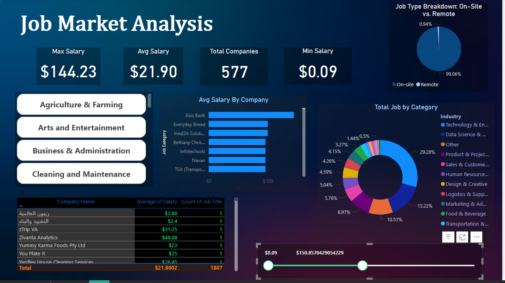
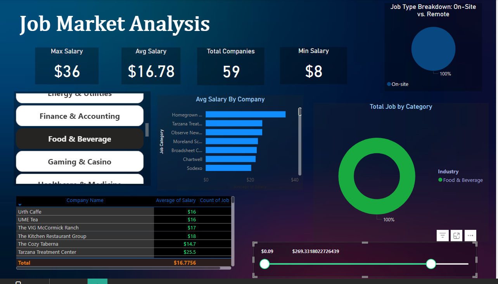
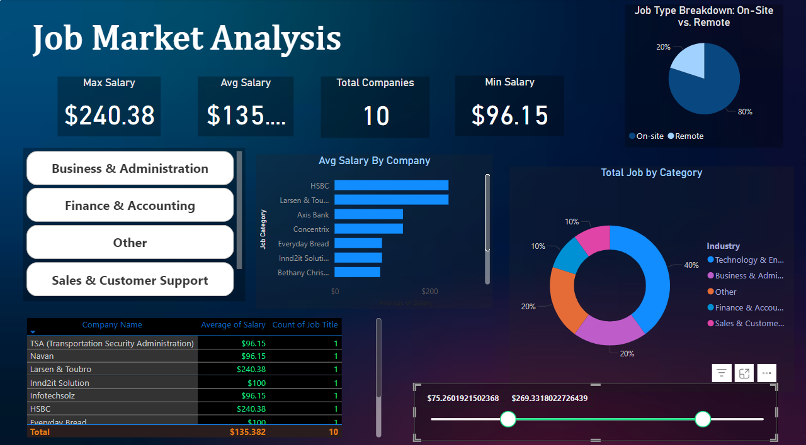

# Job Market Analysis by Skill Set

### Project Overview
This project analyzes the job market trends, focusing on highest demand  fields and salary ranges, using Python for data collection and Power BI for visualization.

### Tools and Libraries
- Python: Used for web scraping, data cleaning, and text processing.
- Libraries: pandas, BeautifulSoup, selenium ,  regex for extracting and processing skills and job titles.
- Power BI: For visualizing demand trends for skills, salary comparisons, and common skill sets.

### Key Tasks
1. Data Collection: Scraped job listings data, including  job titles, and salary information from websites using selenium.
2. Data Cleaning: Processed the data with pandas  and regex to extract relevant skills, job titles, and categorize listings by industry.
3. Data Analysis: Analyzed skill demand frequency and salary ranges across locations and industries.
4. Visualization: Built Power BI dashboards to show trends in skill demand, salary .

The following Power BI visualizations :

#### Demand Trends

#### Food Beverages 

####  Salary Ranges 

